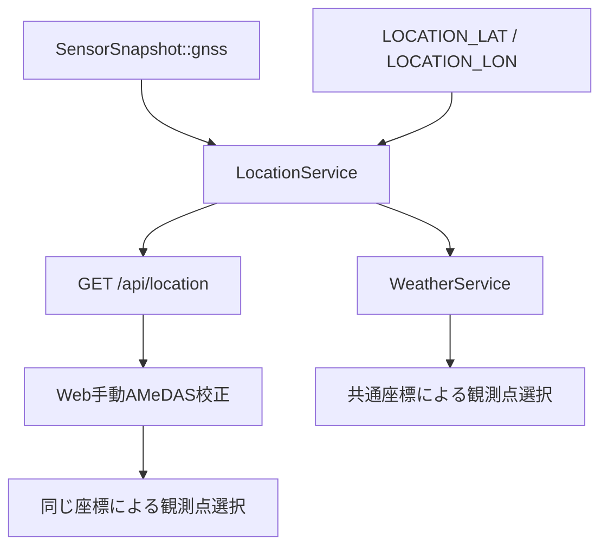

# GNSS現在地による固定座標置換 実装指示書

- 対象プロジェクト: `env_bio_sense`
- 対象GNSS: LC76G
- 前提: LC76GのNMEA取得と`SensorSnapshot::gnss`への反映が実装済みであること
- 文書種別: 実装・検証・受入指示書
- 作成日: 2026-08-18

## 1. 目的

現在ハードコードされている装置座標を、LC76Gが取得した現在地へ置き換える。

対象となる主な用途は次の2つである。

1. ファームウェア側のAMeDAS観測点選択と海面更正気圧のIDW補間
2. Web画面側の手動AMeDAS校正

GNSSが未測位、古い、または品質不足の場合にも機能を停止させないため、固定座標は削除せずフォールバック値として残す。

## 2. 現行コードの状態

固定座標は現在2系統に分かれている。

| 経路 | 現在の座標源 | 該当箇所 |
|---|---|---|
| バックグラウンドAMeDAS取得 | `LOCATION_LAT` / `LOCATION_LON` | `src/services/weather_service.cpp` |
| Web画面の手動校正 | JavaScript内の`myLat` / `myLon`定数 | `src/services/web_server_service.cpp` |

この2箇所を個別にGNSS化してはならない。座標選択規則を`LocationService`へ集約し、ファームウェアとWeb画面が同じ座標を使用するようにする。

GNSS側には既に次の情報が存在する。

```cpp
snapshot.gnss.latitudeDeg
snapshot.gnss.longitudeDeg
snapshot.gnss.fixValid
snapshot.gnss.hdop
snapshot.gnss.hdopValid
snapshot.gnss.satellites
snapshot.gnss.ageMs
snapshot.gnss.sampleMonotonicUs
```

## 3. 確定方針

### 3.1 座標源の優先順位

```text
新鮮で品質条件を満たすGNSS Fix
        ↓ 使用不可
同一起動中の最終採用GNSS座標
        ↓ 期限切れ・未取得
設定ファイルの固定フォールバック座標
        ↓ 無効
位置情報なし
```

座標源は必ず次のいずれかとして公開する。

```cpp
enum class LocationSource : uint8_t {
    Unavailable,
    ConfiguredFallback,
    GnssLastKnown,
    GnssLive
};
```

### 3.2 初期パラメータ

| 項目 | 初期値 | 目的 |
|---|---:|---|
| GNSS Fix最大age | 5000 ms | 古い位置をLiveとして使わない |
| 最低衛星数 | 4 | 不安定な初期Fixを除外する |
| 最大HDOP | 5.0 | 大きく外れた位置を採用しない |
| 採用確認回数 | 3回 | 一時的な異常座標を除外する |
| 確認中の最大ばらつき | 100 m | 連続Fixの整合性確認 |
| Last Known有効期間 | 24時間 | 一時的な屋内・遮蔽に対応 |
| AMeDAS再選択距離 | 1000 m | GNSS揺らぎによる再検索を防止 |
| AMeDAS通常更新 | 現行どおり15分 | 不要な通信を増やさない |

これらは`constexpr`として1箇所に定義し、コード中へ数値を分散させない。

### 3.3 初回実装での永続化

最終採用GNSS座標はRAM内だけに保持する。再起動後、GNSS Fixを取得するまでは設定ファイルの固定座標を使う。

最終位置をFRAMへ永続化するとFRAMフォーマット更新が必要になるため、初回実装の範囲外とする。

## 4. 目標構成



## 5. データモデル

### 5.1 `include/core/sensor_types.h`

次の構造を追加する。

```cpp
enum class LocationSource : uint8_t {
    Unavailable,
    ConfiguredFallback,
    GnssLastKnown,
    GnssLive
};

struct DeviceLocation {
    double latitudeDeg {};
    double longitudeDeg {};

    LocationSource source {LocationSource::Unavailable};
    uint32_t ageMs {UINT32_MAX};
    int64_t capturedMonotonicUs {};

    uint16_t satellites {};
    float hdop {};
    bool valid {};
};
```

意味:

- `latitudeDeg` / `longitudeDeg`: 10進度
- `source`: 実際に採用した座標源
- `ageMs`: GNSS由来座標の経過時間。設定値では`UINT32_MAX`
- `capturedMonotonicUs`: GNSS座標取得時の単調増加時刻
- `satellites` / `hdop`: GNSS由来の場合の品質表示用
- `valid`: AMeDAS選択に使用可能か

## 6. `LocationService`の新設

### 6.1 新規ファイル

- `include/services/location_service.h`
- `src/services/location_service.cpp`

推奨インターフェース:

```cpp
namespace services {

class LocationService {
public:
    void begin();
    void update(const core::GnssData& gnss, uint32_t nowMs);

    core::DeviceLocation current(uint32_t nowMs) const;

    static double distanceMeters(
        double lat1Deg,
        double lon1Deg,
        double lat2Deg,
        double lon2Deg);

private:
    core::DeviceLocation live_ {};
    core::DeviceLocation lastKnown_ {};
    core::DeviceLocation configured_ {};

    // 連続Fix確認用
    double candidateLatDeg_ {};
    double candidateLonDeg_ {};
    uint8_t candidateCount_ {};
    bool hasCandidate_ {};
};

} // namespace services
```

### 6.2 設定座標の読込み

`src/config/secrets.h.example`へ、フォールバックの有効・無効を明示する定義を追加する。

```cpp
#define LOCATION_FALLBACK_ENABLED 0
#define LOCATION_LAT "0"
#define LOCATION_LON "0"
```

実運用の`secrets.h`では、固定座標をフォールバックとして使う場合だけ`LOCATION_FALLBACK_ENABLED`を`1`にする。

要件:

- 緯度が-90～90度、経度が-180～180度に入ることを確認する。
- `LOCATION_FALLBACK_ENABLED == 0`なら、`0,0`を有効なフォールバックとして採用しない。
- 文字列変換失敗を`0`と誤認しない。
- 設定座標は`LocationSource::ConfiguredFallback`とする。

### 6.3 GNSS座標の採用条件

GNSSサンプルは次をすべて満たす場合だけ候補にする。

```text
fixValid == true
ageMs <= 5000
latitude/longitudeが有限値
latitudeが-90～90
longitudeが-180～180
satellites >= 4
hdopValid == true
hdop <= 5.0
```

候補を即時採用せず、3回連続して位置が妥当であることを確認する。

- 最初の候補を基準にする。
- 次の候補が基準から100 m以内ならカウントを増やす。
- 100 mを超えたら候補列をリセットし、新しい位置から確認をやり直す。
- 3回連続で条件を満たしたら`GnssLive`として採用する。
- 採用後は新しい有効FixごとにLive位置を更新する。

移動中に100 m確認条件が厳しすぎる場合は、直近サンプル間距離と速度を考慮する。ただし初回実装では1 Hz・徒歩～車両程度を想定し、100 mを使用する。

### 6.4 Last Knownへの遷移

- GNSS Liveが期限切れになった時点で、最後に採用した座標を`GnssLastKnown`として返す。
- `ageMs`は最後の採用時刻から増加させる。
- 24時間を超えたらLast Knownを使用しない。
- 新しいLive Fixを取得したらLast Knownを更新する。
- 再起動をまたいでLast Knownを復元しない。

### 6.5 スレッド安全性

`LocationService`はメインループ、Weatherタスク、Async Webコールバックから参照される。

次を必須とする。

- 更新中の`double`や64ビット時刻を別タスクが途中読取りしない。
- `update()`は短いmutex内で公開値を交換する。
- `current()`はmutex内でコピーを作り、値ではなく内部参照を返さない。
- mutex保持中にHTTP、Wi-Fi、SD、ログ出力を行わない。

同様に`SensorManager::snapshot()`の生参照を別タスクから直接読まず、GNSS部分を安全にコピーするメソッドを追加する。

```cpp
bool SensorManager::copyGnss(core::GnssData& out) const;
```

## 7. 距離計算

現在のAMeDAS選択では、緯度差と経度差をそのまま同じ尺度として扱っている。装置が移動可能になるため、経度方向へ緯度補正を入れる。

日本国内の近距離用途では、次のequirectangular approximationで十分である。

```cpp
double LocationService::distanceMeters(
    double lat1Deg, double lon1Deg,
    double lat2Deg, double lon2Deg) {

    constexpr double DEG_TO_RAD = 0.017453292519943295;
    constexpr double EARTH_RADIUS_M = 6371000.0;

    const double lat1 = lat1Deg * DEG_TO_RAD;
    const double lat2 = lat2Deg * DEG_TO_RAD;
    const double dLat = (lat2Deg - lat1Deg) * DEG_TO_RAD;
    const double dLon = (lon2Deg - lon1Deg) * DEG_TO_RAD;

    const double x = dLon * std::cos((lat1 + lat2) * 0.5);
    const double y = dLat;
    return EARTH_RADIUS_M * std::sqrt(x * x + y * y);
}
```

AMeDASのIDW重みは、度単位の`distSq`ではなく距離kmの二乗を使用する。

```text
weight = 1 / distanceKm²
```

距離0除算対策は現行処理を維持する。

## 8. `WeatherService`の変更

### 8.1 対象ファイル

- `include/services/weather_service.h`
- `src/services/weather_service.cpp`

### 8.2 依存関係

コンストラクタへ`LocationService&`を追加する。

```cpp
WeatherService(
    SensorManager& sensorManager,
    WifiManager& wifiManager,
    LocationService& locationService);
```

### 8.3 固定座標の除去

次の直接参照を削除する。

```cpp
float myLat = String(LOCATION_LAT).toFloat();
float myLon = String(LOCATION_LON).toFloat();
```

代わりに`LocationService`から位置のコピーを取得する。

```cpp
const auto location = locationService_.current(millis());
if (!location.valid) {
    Logger::warn("Weather", "No valid device location");
    return false;
}
```

`fetchNearestStations()`は使用座標を引数で受ける形にする。

```cpp
bool fetchNearestStations(const core::DeviceLocation& location);
```

これにより、HTTP受信途中で座標源が切り替わっても、1回の観測点選択は同じ座標で完了する。

### 8.4 観測点キャッシュの位置情報

次を`WeatherService`へ追加する。

```cpp
double stationSelectionLatDeg_ {};
double stationSelectionLonDeg_ {};
core::LocationSource stationSelectionSource_ {core::LocationSource::Unavailable};
bool hasStationSelectionLocation_ {};
```

AMeDAS取得前に現在地とキャッシュ作成地点の距離を求める。

```text
観測点キャッシュなし
    → 観測点を選択

現在地がキャッシュ作成地点から1 km以上移動
    → numCachedStations_を0にして再選択

1 km未満
    → 現在の上位5観測点を再利用
```

座標源が`ConfiguredFallback`から`GnssLive`へ変わっても、両座標の距離が1 km未満なら再選択は不要である。距離が1 km以上なら即時にキャッシュを無効化し、次回取得で再選択する。

### 8.5 GNSS移動による更新要求

現在地が1 km以上変化した場合は、次の15分周期を待たずに`needsFetch_=true`にする。ただし次の条件を付ける。

- Wi-Fi/AP動作中は従来どおり取得を保留する。
- 同じ位置変化について連続リトライしない。
- HTTP失敗時は現行どおり5分後に再試行する。
- 前回取得した海面更正気圧は、新規取得成功まで`LastKnown`として維持する。

### 8.6 ログ

通常ログへ次を追加する。

```text
Location source: CONFIGURED_FALLBACK
Location source changed: CONFIGURED_FALLBACK -> GNSS_LIVE
AMeDAS station cache invalidated: moved 1.24 km
Selecting AMeDAS stations at GNSS_LIVE location
```

通常ログへ緯度・経度を出す場合は小数点以下5～6桁までとし、デバッグ用途以上の精度を不要に露出しない。

## 9. Web画面の変更

### 9.1 `WebServerService`へ`LocationService`を注入

対象:

- `include/services/web_server_service.h`
- `src/services/web_server_service.cpp`
- `src/main.cpp`

コンストラクタへ`LocationService&`を追加する。

```cpp
WebServerService(
    storage::StorageManager& storageManager,
    ArchiveManager& archiveManager,
    LocationService& locationService);
```

`extern`グローバルへの新しい依存は追加しない。

### 9.2 `GET /api/location`

次のAPIを追加する。

```json
{
  "valid": true,
  "source": "GNSS_LIVE",
  "latitudeDeg": 35.503788,
  "longitudeDeg": 139.650497,
  "ageMs": 412,
  "satellites": 12,
  "hdop": 0.8
}
```

無効時:

```json
{
  "valid": false,
  "source": "UNAVAILABLE"
}
```

実装要件:

- JSON生成には`ArduinoJson`を使用する。
- `NaN`や`Infinity`をJSONへ出さない。
- `valid=false`のとき座標値を`0,0`として偽装しない。
- APIは`LocationService::current()`のコピーだけを使用する。

### 9.3 JavaScript内の固定座標を削除

次を削除する。

```javascript
const myLat = 35.503788;
const myLon = 139.650497;
```

代わりにAMeDAS取得前に`/api/location`を呼ぶ。

```javascript
const locationRes = await fetch('/api/location');
if (!locationRes.ok) throw new Error('Failed to get device location');

const location = await locationRes.json();
if (!location.valid) throw new Error('GNSS and fallback location are unavailable');

const myLat = location.latitudeDeg;
const myLon = location.longitudeDeg;
```

画面へ使用中の座標源を表示する。

```text
Location: GNSS Live / 12 satellites / HDOP 0.8
Location: Last GNSS fix / age 18 min
Location: Configured fallback
Location unavailable
```

ブラウザ側の距離計算も、ファームウェア側と同じ経度補正を使用する。最低限、現在の`(lat差² + lon差²)`をそのまま使わない。

### 9.4 推奨する後続整理

現状はAMeDASの取得・IDW計算がC++とJavaScriptに重複している。今回の座標置換後、別作業として次へ統一することを推奨する。

1. Webのボタンは`WeatherService`へ「再取得要求」を送るだけにする。
2. 観測点選択とIDW計算はファームウェア側だけで行う。
3. Web画面は処理状況と結果をAPIから表示する。

ただしAPモード中は装置側がインターネットへ接続できない現行制約があるため、この統一はWi-Fi動作設計と合わせて実施する。今回の必須範囲は`/api/location`による座標共有までとする。

## 10. `main.cpp`の変更

グローバルオブジェクトの依存順を次のように整理する。

```cpp
services::SensorManager sensorManager;
services::LocationService locationService;
services::WifiManager wifiManager;
services::WeatherService weatherService(
    sensorManager, wifiManager, locationService);
services::WebServerService webServer(
    storageManager, archiveManager, locationService);
```

初期化:

```cpp
locationService.begin();
```

メインループではセンサー更新後にGNSSの安全なコピーを渡す。

```cpp
sensorManager.update(nowMs);

core::GnssData gnss;
if (sensorManager.copyGnss(gnss)) {
    locationService.update(gnss, nowMs);
}
```

GNSS処理やMAX30102処理を待たせないよう、`LocationService::update()`では通信やファイルアクセスを行わない。

## 11. 状態表示

### 11.1 Web

AMeDAS校正欄へ次を追加する。

- 使用位置源
- GNSSの場合は衛星数、HDOP、age
- 設定値の場合は`Fallback`表示
- 観測点キャッシュを再選択したか

### 11.2 シリアルログ

座標源が変化したときだけ通知する。毎秒同じ座標をログしない。

### 11.3 OLED

OLEDは既存項目で表示領域を使い切っているため、今回の実装では変更しない。

- 座標源、緯度、経度、AMeDAS再選択状態をOLEDへ追加しない。
- 既存レイアウト、文字サイズ、画面切り替えを維持する。
- 動的座標の状態確認はWeb画面とシリアル診断ログで行う。
- OLEDの既存GNSS表示がある場合も、今回の機能追加を理由に項目を増やさない。

## 12. 実装順序

### Phase 1: 座標サービス

- `LocationSource`と`DeviceLocation`追加
- `LocationService`新設
- 設定座標読込み
- GNSS品質・連続Fix判定
- Live/Last Known/Configuredの切替
- 距離計算テスト

完了条件: 入力GNSS状態に応じて期待する座標源を返せる。

### Phase 2: WeatherService統合

- `LOCATION_LAT` / `LOCATION_LON`の直接参照を削除
- `LocationService`注入
- 観測点キャッシュ作成地点の保持
- 1 km移動によるキャッシュ無効化
- 距離km²によるIDW

完了条件: GNSS位置を基準に上位5観測点を選択できる。

### Phase 3: Web統合

- `/api/location`追加
- JavaScript固定座標削除
- 使用位置源の画面表示
- ブラウザ側距離計算修正

完了条件: Web手動校正とバックグラウンド取得が同じ座標を使用する。

### Phase 4: 総合検証

- GNSS Fix前後
- Fix喪失
- 1 km未満/以上の移動
- 設定フォールバック有効/無効
- Webとファームウェアの一致
- 既存センサー退行確認

## 13. 自動テスト

純粋な判定・距離計算部分はArduino依存から分離し、`native`環境でテストする。

```sh
pio test -e native
pio run -e seeed_xiao_esp32s3
```

追加テストケース:

1. 新鮮なFix、衛星4以上、HDOP 5以下を3回受けて`GnssLive`になる。
2. 2回だけではLiveにならない。
3. 3回目が100 m超離れた場合、候補確認をリセットする。
4. `fixValid=false`は採用しない。
5. `ageMs > 5000`は採用しない。
6. 衛星数3以下は採用しない。
7. HDOP 5超は採用しない。
8. `NaN`、緯度91度、経度181度を拒否する。
9. Live期限切れ後に`GnssLastKnown`へ移行する。
10. Last Knownが24時間を超えるとConfiguredへ移行する。
11. Configured無効時は`Unavailable`になる。
12. Configured有効時は設定座標を返す。
13. 緯度・経度が同じ場合の距離が0 mになる。
14. 既知の2地点間距離が許容誤差内になる。
15. 999 m移動では観測点キャッシュを維持する。
16. 1000 m以上移動で観測点キャッシュを無効化する。
17. `/api/location`の`valid=false`応答へ偽座標を含めない。

## 14. 実機検証

### 14.1 GNSS取得前

1. GNSSアンテナを外す、または屋内で起動する。
2. フォールバック有効時、`ConfiguredFallback`になることを確認する。
3. WebとバックグラウンドAMeDASが設定座標を使うことを確認する。

### 14.2 GNSS取得後

1. 屋外で有効Fixを取得する。
2. 3回連続確認後、`GnssLive`へ切り替わることを確認する。
3. Webの`/api/location`とシリアル診断が同じ座標源・座標を返すことを確認する。
4. GNSS位置付近のAMeDAS上位5地点が選ばれることを確認する。

### 14.3 Fix喪失

1. アンテナを遮蔽する。
2. Live期限切れ後、`GnssLastKnown`へ切り替わることを確認する。
3. 観測点キャッシュを毎秒作り直さないことを確認する。
4. 位置ageが増加することを確認する。

### 14.4 移動試験

1. 1 km未満の座標変化では観測点キャッシュが維持されることを確認する。
2. 1 km以上移動した座標を与える。
3. キャッシュが1回だけ無効化されることを確認する。
4. 新しい位置で上位5観測点と海面更正気圧が更新されることを確認する。

### 14.5 フォールバック無効

1. `LOCATION_FALLBACK_ENABLED=0`で起動する。
2. GNSS Fix前は`Unavailable`になることを確認する。
3. AMeDAS処理が`0,0`を使用せず、安全に保留されることを確認する。

## 15. 受入条件

### 座標選択

- [ ] 座標源の優先順位がGNSS Live → Last Known → Configured → Unavailableになっている。
- [ ] GNSS品質、age、範囲、連続Fix条件を満たすまでLiveとして採用しない。
- [ ] 座標源とageを外部へ公開できる。
- [ ] `0,0`を変換失敗や未設定の代替値として使用しない。
- [ ] 再起動後のLast Knownを偽造しない。

### WeatherService

- [ ] `weather_service.cpp`から`LOCATION_LAT` / `LOCATION_LON`の直接使用がなくなっている。
- [ ] AMeDAS選択は`LocationService`から取得した1つの座標コピーで完了する。
- [ ] 距離計算へ経度方向の緯度補正が入っている。
- [ ] 1 km未満のGNSS揺らぎで観測点を再選択しない。
- [ ] 1 km以上移動すると次回取得を要求し、上位観測点を再選択する。
- [ ] GNSSが一時的に失われても直前の海面更正気圧を維持する。

### Web

- [ ] JavaScript内の`myLat` / `myLon`固定値が削除されている。
- [ ] `/api/location`から座標と座標源を取得する。
- [ ] 無効な位置ではAMeDAS計算を行わず、理由を表示する。
- [ ] Webとバックグラウンド処理が同じ位置を使用する。
- [ ] Web上でGNSS Live、Last Known、Configured、Unavailableを識別できる。

### 品質・退行

- [ ] `pio test -e native`が成功する。
- [ ] `pio run -e seeed_xiao_esp32s3`が成功する。
- [ ] GNSS UART、PPS、MAX30102、SD/FRAM、OLEDが退行していない。
- [ ] OLEDへ新しい表示項目を追加せず、既存レイアウトを維持している。
- [ ] 座標更新によって毎秒HTTP通信や大量ログが発生しない。
- [ ] Async Webコールバックとセンサー更新間で座標の途中値を読まない。

## 16. 実装時の禁止事項

- JavaScriptとC++に別々の固定座標を残さない。
- GNSSの`fixValid`だけを見て、age・範囲・品質を無視しない。
- GNSS値が無効なとき緯度経度`0,0`を使用しない。
- GNSS座標が数m揺れるたびにAMeDAS観測点一覧を再取得しない。
- HTTP処理中に現在地を何度も読み直して、1回の計算へ異なる座標を混ぜない。
- 度単位の緯度差・経度差を緯度補正なしで距離として扱わない。
- `LocationService`のmutex保持中にネットワークやログ処理を行わない。
- フォールバック座標を削除して、屋内やFix前に機能停止させない。
- 動的座標の状態表示をOLEDへ追加しない。

## 17. 成果物

- `LocationService`実装
- `LocationSource` / `DeviceLocation`データ型
- GNSS品質・連続Fix・Last Known判定
- `WeatherService`の動的位置対応
- AMeDAS観測点キャッシュの移動判定
- `GET /api/location`
- Web画面の固定座標除去と位置源表示
- ネイティブ単体テスト
- GNSS取得前後、Fix喪失、移動、フォールバックの実機試験結果
