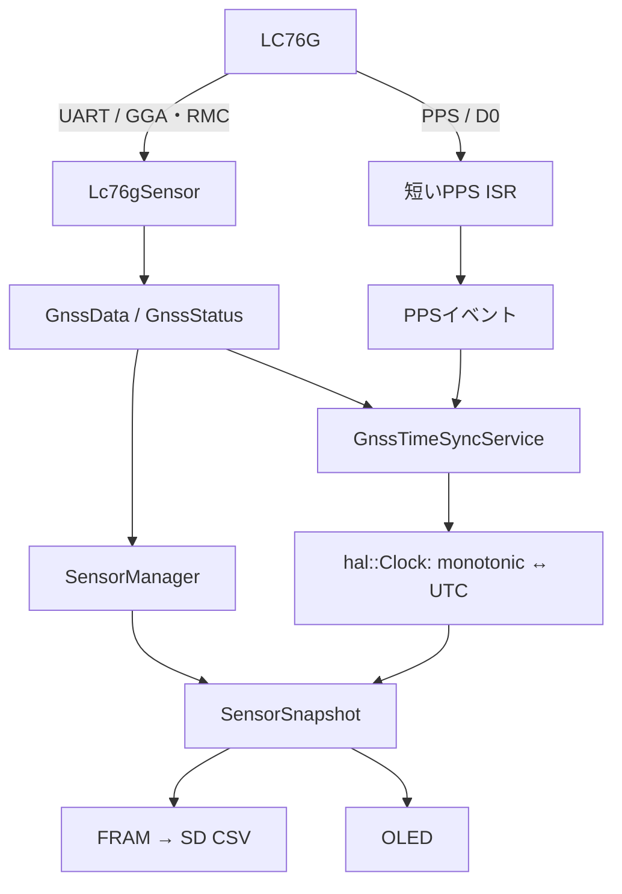
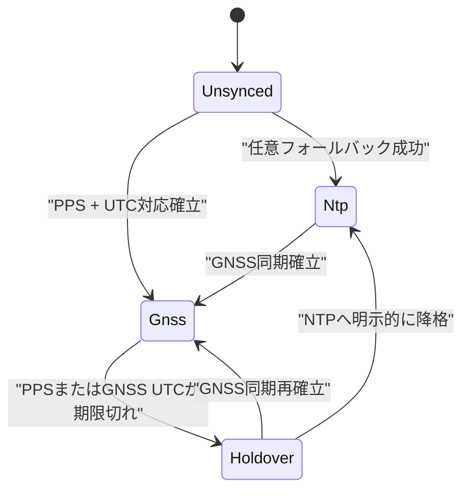

# LC76G GNSSモジュール統合 実装指示書

- 対象プロジェクト: `env_bio_sense`
- 対象ボード: Seeed Studio XIAO ESP32-S3
- 対象GNSS基板: Waveshare LC76G GNSS Module（LC76G (AB)）
- 文書種別: 実装・検証・受入指示書
- 初回実装の測位周期: 1 Hz
- 作成日: 2026-08-18

## 1. 目的

LC76Gを、単なる位置センサーではなく次の2つの役割を持つデバイスとして統合する。

1. 緯度・経度・海抜高度・速度・進行方位・衛星数・HDOPを提供する位置情報源
2. NMEAの絶対UTCとPPSの正確な秒境界を組み合わせる時刻源

GNSSデータは既存の環境・生体データと同じスナップショットおよびSD CSVへ記録する。ただし、異なる更新周期の値を正しく解釈できるよう、値だけでなく有効性、取得時刻、経過時間も保存する。

## 2. 実装方針として確定する事項

| 項目 | 決定 |
|---|---|
| 配線 | PPS=`D0/GPIO1`、SD_CS=`D1/GPIO2`、MAX30102_INT=`D2/GPIO3`、XIAO TX=`D6/GPIO43`、XIAO RX=`D7/GPIO44` |
| UART | 8N1、フロー制御なし。115200 bpsを第一候補として確認し、Waveshare基板差異に備えて9600 bpsも検出候補にする |
| 初回更新周期 | 1 Hz。10 Hz化は初回受入完了後の別作業 |
| NMEA | GGAとRMCを必須とする。GSA/GSVは初回実装の必須対象外 |
| NMEA処理 | `TinyGPSPlus`を使用し、メインループから非ブロッキングに継続処理する |
| Fix判定 | GGA/RMCとデータ鮮度から判定する。PPSの有無では判定しない |
| PPS | UTC秒境界の取得専用。立ち上がりエッジで`esp_timer_get_time()`を保存する |
| 時刻源優先順位 | GNSS > NTPフォールバック > 未同期。PPS喪失後は最後の対応関係によるholdoverへ移行する |
| システム時計 | 毎秒`settimeofday()`しない。GNSS UTCと単調増加時刻の対応を保持してUTCへ変換する |
| SDログ | 既存データと同一CSVに記録する。Raw NMEAは通常CSVへ入れない |
| FRAM | GNSSとレコード時点UTCを保持できるよう永続化フォーマットを更新する |
| 表示 | Fix状態、衛星数、HDOP、PPS/時刻同期状態を表示する |

### 2.1 UARTボーレートに関する注意

QuectelのLC76G仕様ではデフォルト115200 bpsだが、Waveshareの公開例は9600 bpsを使用している。このため、どちらか一方を無条件に前提にしない。

実装は次の順序で判定する。

1. 115200 bpsで受信を開始する。
2. 3秒以内にチェックサム正常なNMEAセンテンスを1件以上受信できれば115200 bpsを採用する。
3. 受信できなければUARTを再初期化し、9600 bpsで同じ判定を行う。
4. 採用したボーレートを起動ログとGNSS診断状態へ残す。
5. 初回実装ではモジュールの不揮発設定を自動変更しない。

## 3. 現行コードを基準にした修正点

現行プロジェクトを確認した結果、元計画から次を修正する。

| 元計画 | 現行コードに合わせた指示 |
|---|---|
| `pio run -e esp32s3` | 実際の環境名に合わせて`pio run -e seeed_xiao_esp32s3`を使用する |
| `sd_storage.cpp`を変更 | 実際の記録経路は`storage/storage_records.h`と`storage/storage_manager.cpp`。ここを変更する |
| `data_logger.cpp`へGNSS列を追加 | `DataLogger`は現行`main.cpp`から使われていないため、今回の主実装対象にしない |
| 9600 bps固定 | 115200 bpsを第一候補、9600 bpsをフォールバックとして実機判定する |
| PPSでFix判定 | FixはNMEA、PPSは時刻同期として完全に分離する |
| `DeviceState` 1個でGNSSを表現 | UART/NMEA、Fix、UTC、PPS、時刻同期を個別状態で保持する |
| `main.cpp`だけでGNSS更新 | 既存構造に合わせ、ドライバを`SensorManager`へ統合し、時刻同期サービスとは責務を分離する |
| 既存FRAMレコードへ単純追加 | 現在の64バイトスロットには収まらないため、フォーマット更新と移行手順を実施する |
| 起動時にNTPを必ず待つ | GNSSを主時刻源にし、NTPは任意のフォールバックへ変更する |

現行の`pins.h`は物理番号として概ね正しいが、`GNSS_TX`/`GNSS_RX`のコメントがLC76G側とXIAO側のどちらを指すか曖昧である。今回の修正でXIAO側基準に統一する。

## 4. 対象範囲

### 4.1 初回実装に含める

- LC76Gの電源、UART、PPS配線
- UARTボーレート判定とNMEA受信
- GGA/RMCのパース
- GNSSデータおよび詳細状態のスナップショット反映
- PPS割り込みと単調増加時刻の記録
- GNSS UTCとPPSの対応付け
- GNSS主時刻源、holdover、任意NTPフォールバック
- FRAMレコードとSD CSVへのGNSS・UTC情報の記録
- OLED表示
- 自動テスト、実機試験、障害・再捕捉試験

### 4.2 初回実装に含めない

- 10 Hz測位
- GSV全衛星情報の常時記録
- Raw NMEAの通常運用ログ
- EPO/AGNSSデータ投入
- GNSS低消費電力モード
- RTCまたはMCU発振器の本格的な周波数推定・PLL制御
- GNSSと気圧高度のセンサーフュージョン
- Web画面への地図表示

## 5. 目標アーキテクチャ



責務は次のように分ける。

- `Lc76gSensor`: UART、NMEA、位置・時刻候補、PPSエッジ取得
- `GnssTimeSyncService`: PPSとNMEA UTCの対応確認、同期状態、holdover
- `hal::Clock`: 単調増加時刻とUTCの変換、時刻源の公開
- `SensorManager`: GNSSを含むセンサースナップショットの集約
- `StorageManager`: バージョン付きFRAMレコードとCSV出力
- `DisplayManager`: ユーザー向け状態表示

## 6. 配線指示

### 6.1 接続表

| LC76G基板 | XIAO ESP32-S3 | 信号方向 | 用途 |
|---|---|---|---|
| VCC | 3V3 | XIAO → LC76G | 電源 |
| GND | GND | 共通 | 基準電位 |
| TX | D7 / GPIO44 / RX | LC76G → XIAO | NMEA受信 |
| RX | D6 / GPIO43 / TX | XIAO → LC76G | 設定コマンド |
| PPS | D0 / GPIO1 | LC76G → XIAO | 1 PPS割り込み |

既存の他信号は次を維持する。

| 機能 | XIAOピン |
|---|---|
| SD_CS | D1 / GPIO2 |
| MAX30102_INT | D2 / GPIO3 |
| BMP5_INT | D3 / GPIO4 |
| I2C SDA | D4 / GPIO6 |
| I2C SCL | D5 / GPIO7 |

### 6.2 配線上の必須注意

- UARTはTX同士、RX同士ではなく交差接続する。
- GNDを必ず共通化する。
- Waveshare基板のVCCは3.3～5 V対応だが、本構成ではXIAOの3V3を使用する。
- 付属ケーブルは赤=VCC、黒=GNDとは限らない。色ではなく基板シルクと導通で確認する。
- PPSは初期実装では`INPUT`、立ち上がりエッジとする。内部プルアップ/プルダウンは有効にしない。
- PPSの電圧、極性、パルス幅をオシロスコープまたはロジックアナライザーで一度確認する。
- アンテナは白い受信面を上にし、初回Fix試験は屋外の開けた場所で行う。

## 7. ファイル別実装指示

### 7.1 `platformio.ini`

`[env:seeed_xiao_esp32s3]`の`lib_deps`へTinyGPSPlusを追加する。バージョン範囲は`platformio.ini`で明示し、生成物である`.pio`はコミットしない。

```ini
mikalhart/TinyGPSPlus @ ^1.1.0
```

必要なら診断用ビルドフラグを追加する。

```ini
-D GNSS_RAW_NMEA_DEBUG=0
-D GNSS_PPS_DIAGNOSTICS=0
```

Raw NMEAのSD保存は通常ビルドで無効とする。

### 7.2 `include/hal/pins.h`

XIAO側から見た名前へ統一する。

```cpp
constexpr uint8_t GNSS_PPS     = D0;  // GPIO1, LC76G PPS -> XIAO
constexpr uint8_t SD_CS        = D1;  // GPIO2
constexpr uint8_t MAX30102_INT = D2;  // GPIO3
constexpr uint8_t BMP5_INT     = D3;  // GPIO4

constexpr uint8_t GNSS_UART_TX = D6;  // GPIO43, XIAO TX -> LC76G RX
constexpr uint8_t GNSS_UART_RX = D7;  // GPIO44, XIAO RX <- LC76G TX
```

`SD_CS = 2`のような生GPIO番号ではなく`D1`を使用し、ピンマップ上の意図を明確にする。旧名`GNSS_TX`と`GNSS_RX`は全参照を同時に置換し、別名として残さない。

可能ならコンパイル時チェックを追加する。

```cpp
static_assert(GNSS_PPS != SD_CS);
static_assert(GNSS_UART_TX != GNSS_UART_RX);
```

### 7.3 `include/core/sensor_types.h`

`SensorId`へ`Gnss`を追加する。`DeviceState`自体は再利用するが、GNSS全体を1個の`DeviceState`だけで表さない。

最低限、次の意味を持つ構造を追加する。フィールド名は単位を含める。

```cpp
enum class TimeSource : uint8_t {
    Unset,
    Manual,
    Ntp,
    Gnss,
    Holdover
};

struct GnssData {
    double latitudeDeg {};
    double longitudeDeg {};

    float altitudeMslM {};
    float speedMps {};
    float courseDeg {};
    float hdop {};
    uint16_t satellites {};

    bool fixValid {};
    bool altitudeValid {};
    bool speedValid {};
    bool courseValid {};
    bool hdopValid {};
    bool timeValid {};

    int64_t sampleMonotonicUs {};
    int64_t utcEpochMs {};
    uint32_t ageMs {UINT32_MAX};
};

struct GnssStatus {
    DeviceState transportState {DeviceState::Unknown};

    bool nmeaAlive {};
    bool ppsSeen {};
    bool ppsRecent {};
    bool timeDisciplined {};

    uint32_t nmeaAgeMs {UINT32_MAX};
    uint32_t fixAgeMs {UINT32_MAX};
    uint32_t ppsAgeMs {UINT32_MAX};

    uint32_t ppsCount {};
    int32_t lastPpsIntervalUs {};
    uint32_t uartBaud {};
    uint32_t checksumFailures {};
};
```

定義上の注意:

- 緯度・経度はランタイム上`double`とする。
- `altitudeMslM`はGGAの平均海面基準高度であり、BMP581の`altitudeM`と区別する。
- `ageMs`は現在時刻から最後のGNSS位置サンプル受信時刻までの差とする。
- 一度取得した位置値を保持してもよいが、古い値は`fixValid=false`と`ageMs`で明示する。
- 未取得時の`ageMs`類は`UINT32_MAX`とする。

### 7.4 `include/core/sensor_snapshot.h`

次を追加する。

```cpp
struct SensorSnapshot {
    EnvironmentData environment {};
    PpgData ppg {};
    GnssData gnss {};
};

struct SystemStatus {
    // 既存項目...
    GnssStatus gnss {};
    TimeSource timeSource {TimeSource::Unset};
};
```

`SensorSnapshot`はメインループ、表示タスク、ストレージタスクから参照される。特に64ビット時刻と`double`を追加すると32ビットMCU上で途中値を読む危険があるため、参照をそのまま返す方式をやめる。

次のいずれかで一貫したコピーを返す。

- 短時間のmutex内でスナップショット全体をコピーする。
- 更新側でローカル値を完成させた後、critical section内で公開用スナップショットへコピーする。

ドライバI/OやSD書き込み中はスナップショットmutexを保持しない。

### 7.5 新規 `include/drivers/sensors/lc76g_sensor.h`

### 7.6 新規 `src/drivers/sensors/lc76g_sensor.cpp`

推奨インターフェース:

```cpp
struct PpsEvent {
    uint32_t sequence {};
    int64_t monotonicUs {};
};

class Lc76gSensor {
public:
    explicit Lc76gSensor(HardwareSerial& serial);

    bool begin();
    void update(uint32_t nowMs);

    bool readGnss(core::GnssData& out, uint32_t nowMs) const;
    core::GnssStatus status(uint32_t nowMs) const;
    bool takePpsEvent(PpsEvent& out);
};
```

#### UART初期化

- デバッグ用USB CDCの`Serial`と分離し、`HardwareSerial(1)`または`Serial1`を使う。
- RXバッファは`begin()`より前に2048バイトへ拡張する。
- `SERIAL_8N1`、RX=`GNSS_UART_RX`、TX=`GNSS_UART_TX`を指定する。
- ボーレート判定は7.2節の手順に従い、メインループを長時間停止しない状態機械として実装する。

```cpp
serial_.setRxBufferSize(2048);
serial_.begin(baud, SERIAL_8N1,
              hal::pins::GNSS_UART_RX,
              hal::pins::GNSS_UART_TX);
```

#### NMEA処理

`update()`はUARTにある文字をTinyGPSPlusへ渡す。ただし1回の呼び出しで処理する最大文字数を、例えば512バイトへ制限し、MAX30102の更新を長時間妨げない。

```cpp
size_t budget = 512;
while (budget-- > 0 && serial_.available() > 0) {
    gps_.encode(static_cast<char>(serial_.read()));
}
```

要件:

- GGAからFix quality、衛星数、HDOP、平均海面高度を取得する。
- RMCからUTC日付・時刻、Fix状態、緯度・経度、対地速度、真方位を取得する。
- `GN`、`GP`などのtalker IDを固定前提にしない。
- NMEAチェックサム正常センテンスの受信時刻を`lastValidNmeaMs`として更新する。
- 受信文字があるだけでは`nmeaAlive=true`にしない。
- RMCの状態`A`またはGGA qualityが有効で、かつデータが新鮮な場合だけ`fixValid=true`にする。
- TinyGPSPlusが保持する前回値を、新しい測位と誤認しない。`isUpdated()`と`age()`を確認する。
- 位置サンプルを確定した時点で`esp_timer_get_time()`を`sampleMonotonicUs`へ保存する。
- UTC変換は常にUTCとして行い、JSTを加算しない。
- 日付・時刻の片方だけが新しい過渡状態を1サンプルとして混ぜない。

初期閾値:

```cpp
constexpr uint32_t NMEA_ALIVE_TIMEOUT_MS = 2500;
constexpr uint32_t FIX_STALE_TIMEOUT_MS  = 3000;
constexpr uint32_t UTC_STALE_TIMEOUT_MS  = 3000;
constexpr uint32_t PPS_RECENT_TIMEOUT_MS = 2500;
```

#### PPS ISR

ISRは次だけを行う。

1. `esp_timer_get_time()`を取得する。
2. シーケンス番号を増やす。
3. 小さな固定長キューまたはリングバッファへイベントを置く。

ISR内で行ってはいけない処理:

- `Serial`出力
- TinyGPSPlus処理
- `settimeofday()`または時刻同期計算
- SD/FRAM/I2Cアクセス
- 動的メモリ確保
- 長いロック待ち

```cpp
void IRAM_ATTR Lc76gSensor::onPps() {
    const int64_t nowUs = esp_timer_get_time();
    // ISR-safeな固定領域へtimestampとcounterだけを保存する。
}
```

連続エッジ間隔をタスク側で計算し、短すぎるグリッチ、イベント欠落、1000000 µsからの偏差を診断値として記録する。

PPS設定は変更可能であり、プロトコル仕様上も「初回Fix後」「3D Fix時のみ」「常時」などが存在する。したがって、`ppsSeen`や`ppsRecent`を`fixValid`へ代用しない。

### 7.7 新規 `include/services/gnss_time_sync_service.h`

### 7.8 新規 `src/services/gnss_time_sync_service.cpp`

このサービスは`Lc76gSensor`からPPSイベントとNMEA UTC候補を受け取り、次のアンカーを管理する。

```cpp
struct UtcAnchor {
    int64_t ppsMonotonicUs {};
    int64_t ppsUtcEpochUs {};
    uint32_t ppsSequence {};
    bool valid {};
};
```

有効なアンカーがある場合、任意の単調増加時刻を次でUTCへ変換する。

```text
UTC(t) = anchor.utc + (t.monotonic - anchor.monotonic)
```

#### PPSとNMEA秒の対応付け

NMEAセンテンスのUART到着には遅延があるため、センテンスをパースした瞬間を秒境界として扱わない。

実装要件:

1. 各PPSエッジの`monotonicUs`を保持する。
2. RMCの日付・時刻をUTC epochへ変換する。
3. LC76Gのプロトコル仕様と実測結果に基づき、そのRMC UTCが直前・同一・次のどのPPSを表すかを確定する。
4. 1秒オフセットの可能性を暗黙に決め打ちしない。
5. 連続3組以上でUTCが1秒ずつ増加し、PPS周期が正常であることを確認してから`timeDisciplined=true`にする。
6. 関係が確定していない間は`timeValid`であっても`timeDisciplined=false`とする。

実測時は、PPSエッジ時刻、RMC全文、RMC受信完了時刻、採用したUTC秒を同じ診断行へ出す。独立したUTC参照または仕様書と照合し、±1秒の曖昧さがないことを受入前に確認する。

#### 状態遷移



- `Gnss`: PPSとUTCの対応が現在有効
- `Holdover`: 最後のアンカーからMCUの単調増加時刻で自走中
- `Ntp`: GNSSが使えず、NTPまたは手動時刻を使用
- `Unsynced`: 信頼できるUTCなし

PPSが復帰したときは、現在時刻を無条件に逆方向へ飛ばさない。差分を測定し、初回実装では次のルールとする。

- 未同期からの初回確立: アンカーを即時採用する。
- holdoverからの復帰: 差が小さい場合はアンカーを更新する。
- 差が設定閾値を超える場合: 診断エラーを記録し、連続確認後に採用する。
- 外部へ返すUTCは通常動作中に後退させない。

本格的な周波数推定や`adjtime()`によるslewは次段階とし、初回は単調増加時刻とのアンカー方式を完成させる。

### 7.9 `include/hal/clock.h` / `src/hal/clock.cpp`

現在の`Clock`はPOSIX時計と`timeSet_`だけを管理している。GNSS時刻を扱えるよう、次の機能を追加する。

- `nowMonotonicUs()`
- `setUtcAnchor(utcEpochUs, monotonicUs, TimeSource)`
- `utcEpochUsAt(monotonicUs)`
- `utcEpochMsAt(monotonicUs)`
- `source()`
- `isTimeSet()`
- `isDisciplined()`または同等の品質状態

既存の`getEpoch()`、`getFormattedDate()`、`getFormattedTime()`は互換性を維持し、新しいアンカーを使用する。

要件:

- アンカーの読み書きはスレッドセーフにする。
- 内部の絶対時刻はUTCで保持する。
- JSTは画面表示や日付ファイル名生成時だけ適用する。
- 毎秒`settimeofday()`しない。
- POSIXシステム時計を合わせる場合は初回同期または明示的な大差補正に限定する。
- SDレコードの時刻は「現在時刻からuptime差分を引く」方法ではなく、レコード自身が持つUTCを使用する。

### 7.10 `src/services/time_manager.h` / `src/services/time_manager.cpp`

現状は`setup()`中に最大約30秒Wi-Fi/NTPを待つ。これをGNSS主時刻源の方針へ合わせる。

- GNSSの初期化・測位はWi-Fi資格情報なしで開始できること。
- NTPは無効化可能なフォールバックとする。
- NTPを使う場合もGNSS取得猶予後に開始し、センサー更新を長時間ブロックしない。
- GNSS同期が確立したら`TimeSource::Gnss`を優先する。
- NTP同期済みでも、後からGNSS同期が確立したらGNSSへ昇格する。
- Wi-Fiのノイズ・消費電力を避ける現行方針は維持し、同期完了後は必要に応じてWi-Fiを停止する。

推奨初期値:

```cpp
constexpr bool ENABLE_NTP_FALLBACK = true;
constexpr uint32_t GNSS_GRACE_BEFORE_NTP_MS = 60000;
```

NTPを完全無効にしても、屋外でGNSS UTCとPPSだけにより日付付きログが開始できることを必須とする。

### 7.11 `include/services/sensor_manager.h` / `src/services/sensor_manager.cpp`

`Lc76gSensor`と`GnssTimeSyncService`を追加する。

初期化順序:

1. `main.cpp`で`StorageManager`を従来どおり初期化する。
2. `SensorManager::begin()`の中でGNSS UART/PPSを早い段階で初期化する。
3. 他センサーを従来どおり初期化する。
4. NTPフォールバックを待たずにメインループ更新を開始する。

`update()`で毎回行う処理:

1. `lc76g_.update(nowMs)`を呼ぶ。
2. 保留PPSイベントを`gnssTimeSync_`へ渡す。
3. 最新GNSSデータを取得する。
4. `snapshot_.gnss`へ反映する。
5. `status_.gnss`と`status_.timeSource`を反映する。

GNSS処理は1 HzだがUART受信は連続しているため、`lc76g_.update()`自体を1秒間隔に制限しない。メインループごとに短く呼び出す。

### 7.12 `src/main.cpp`

修正内容:

- `HardwareSerial`またはドライバの所有関係を明確にする。
- 現行のブロッキング`TimeManager::begin()`をGNSS優先の非ブロッキング開始へ置き換える。
- 起動ログへGNSSピン、採用UARTボーレート、PPSピンを追加する。
- 表示と記録へ渡すスナップショットはmutex保護されたコピーを使う。
- 既存MAX30102の高速更新を妨げない。
- 現在のSD/FRAM記録周期5秒は初回実装では維持する。GNSS受信自体は1 Hzで継続する。

起動ログ例:

```text
GNSS UART TX: D6 / GPIO43 -> LC76G RX
GNSS UART RX: D7 / GPIO44 <- LC76G TX
GNSS PPS    : D0 / GPIO1
GNSS UART   : probing 115200 bps
GNSS UART   : NMEA detected at 9600 bps
```

### 7.13 `include/storage/storage_records.h`

現行`PersistentRecord`は64バイト固定スロットで、GNSSとUTCを追加する余地がない。次を実施する。

1. `FRAM_FORMAT_VERSION`を3から4へ上げる。
2. `EnvironmentalRecord`を用途に合う`SensorRecordV4`等へ改名する。
3. `RECORD_SLOT_SIZE`を128バイトへ変更する。
4. `static_assert(sizeof(PersistentRecordV4) <= RECORD_SLOT_SIZE)`を追加する。
5. レコード時点のUTCと単調増加時刻を保存する。
6. GNSSの値、有効性、age、PPS/time source状態を保存する。

永続化上は緯度・経度を`double`の生バイナリで保存せず、固定小数点を推奨する。

```cpp
int32_t gnssLatitudeE7;   // degrees × 10^7
int32_t gnssLongitudeE7;  // degrees × 10^7
```

追加する代表フィールド:

```cpp
int64_t sampleMonotonicUs;
int64_t utcEpochMs;

int32_t gnssLatitudeE7;
int32_t gnssLongitudeE7;
float gnssAltitudeMslM;
float gnssSpeedMps;
float gnssCourseDeg;
float gnssHdop;

uint32_t gnssAgeMs;
uint32_t ppsAgeMs;
uint16_t gnssSatellites;
uint16_t gnssValidFlags;
uint8_t timeSource;
```

`gnssValidFlags`は少なくとも次を区別する。

- Fix/位置
- 高度
- 速度
- 方位
- HDOP
- GNSS UTC
- PPS recent
- time disciplined

128バイト化によりFRAMリング容量は448件から224件へ減る。現行5秒記録では約18分40秒分である。この容量低下をREADMEまたは運用文書へ明記する。

#### v3からv4への移行

スロットサイズが変わるため、既存リングバッファをそのまま解釈してはいけない。

リリース手順:

1. 旧ファームウェアでFRAM保留件数を0までSDへflushする。
2. v4ファームウェアを書き込む。
3. 起動時にv3 superblockを検出したら、センサー校正値とboot countを保持しつつリングのread/write indexを初期化する。
4. format versionを4としてCRCを再作成する。
5. 移行をイベントログへ記録する。

旧リングに未flushデータがある場合は自動破棄せず、警告して移行を止めるか、明示的な保守操作を要求する。

### 7.14 `include/storage/storage_manager.h` / `src/storage/storage_manager.cpp`

`appendRecord()`でスナップショット取得時点の値をバージョン4レコードへ変換する。

要件:

- `sampleMonotonicUs`は常に保存する。
- UTCが有効な場合だけ`utcEpochMs`とUTC-valid flagを保存する。
- UTCが無効な行へ1970年や現在時刻を埋めない。
- 緯度・経度は範囲検査後にE7へ変換する。
- 古いGNSS位置は数値を保持してもよいがFix-valid flagを立てない。
- CRC対象へ追加フィールドを含める。
- SD出力はレコード自身の`utcEpochMs`を使う。
- 再起動をまたぐレコードに対し、現在の`millis()`との差から過去時刻を推定しない。

CSVヘッダー例:

```text
Sequence,UptimeMs,SampleMonotonicUs,TimestampUtc,TimeSource,
CO2_ppm,Temp_C,RH_pct,Pressure_hPa,VOC_Index,NOx_Index,
HR_bpm,SpO2_pct,BMP_Altitude_m,
GNSS_Lat_deg,GNSS_Lon_deg,GNSS_AltMSL_m,GNSS_Speed_mps,
GNSS_Course_deg,GNSS_Satellites,GNSS_HDOP,
GNSS_FixValid,GNSS_TimeValid,GNSS_AgeMs,PPS_AgeMs,
GNSS_TimeDisciplined,ValidFlags
```

実際のCSVヘッダーは1行で出力する。

CSVの値規則:

- `TimestampUtc`: `YYYY-MM-DDTHH:MM:SS.sssZ`
- 緯度・経度: 小数点以下7桁
- bool: `0`または`1`
- 無効な数値: 空欄を推奨。既存互換性を優先する場合は`nan`に統一する
- `TimeSource`: `UNSET`、`MANUAL`、`NTP`、`GNSS`、`HOLDOVER`
- ファイル名の日付は現行どおりJSTでもよいが、列名`TimestampUtc`の値は必ずUTCとする

Raw NMEAを保存する場合は診断ビルド限定で`/debug/gnss_nmea.log`へ分離し、通常CSVへ混在させない。

### 7.15 `include/services/display_manager.h` / `src/services/display_manager.cpp`

`ScreenId::Gnss`を追加し、OverviewにもGNSSの最小状態を1行表示する。

Overview表示例:

```text
G:FIX S12 H0.8 T:G
```

状態別表示:

| 状態 | 表示例 |
|---|---|
| UART/NMEAなし | `G:OFFLINE` |
| NMEAあり、Fixなし | `G:SEARCH S05` |
| Fixあり | `G:FIX S12 H0.8` |
| 古い位置 | `G:STALE 4.2s` |
| PPS同期中 | `T:GNSS PPS` |
| PPS喪失後 | `T:HOLD` |
| NTPフォールバック | `T:NTP` |
| 時刻未同期 | `T:--` |

GNSS詳細画面には次を表示する。

- Fix/SEARCH/OFFLINE
- 衛星数
- HDOP
- 緯度・経度の短縮表示
- PPS age
- `TimeSource`

128×64の表示に収まらない場合は、Overviewを過密にせずGNSS詳細画面へ分離する。画面切り替え入力が未実装のため、初回はOverview/GNSSを一定時間で自動切り替えするか、Overviewの最小1行を必須成果とする。

## 8. 実装順序

### Phase 0: 配線・生NMEA確認

- 電源、GND、TX/RXだけを接続する。
- 115200 bps、次に9600 bpsで生NMEAを確認する。
- 採用ボーレートを記録する。
- GGA/RMCが出力されることを確認する。
- その後PPSをD0へ接続する。

完了条件: チェックサム正常なGGA/RMCを連続受信できる。

### Phase 1: GNSSドライバ

- TinyGPSPlus追加
- ピン名修正
- `GnssData`/`GnssStatus`追加
- UART受信、パース、鮮度判定
- SensorManagerとスナップショットへ統合

完了条件: 位置、Fix、衛星数、HDOP、UTCがシリアル診断へ表示される。

### Phase 2: PPS・時刻同期

- PPS ISR
- PPSイベント受け渡し
- NMEA UTCとの秒対応確認
- monotonic↔UTCアンカー
- GNSS/NTP/holdover状態遷移

完了条件: PPS秒境界とUTCの対応が連続して成立し、±1秒の曖昧さがない。

### Phase 3: FRAM・SDログ

- v4レコード
- 128バイトスロット
- v3移行処理
- CSV列追加
- UTCをレコードへ直接保存

完了条件: 電源断・SD抜去・再挿入を含め、GNSS付きレコードがCRC正常でSDへflushされる。

### Phase 4: 表示・運用統合

- OverviewのGNSS状態
- GNSS詳細表示
- NTPフォールバック設定
- 起動・障害診断ログ

完了条件: ユーザーが画面だけでGNSS通信、Fix、時刻同期の違いを判別できる。

### Phase 5: 総合試験

- 自動テスト
- 屋外Fix
- PPS 1000周期
- 切断・復帰
- SD/表示/PPG同時負荷

完了条件: 10章の受入条件をすべて満たす。

## 9. 検証計画

### 9.1 自動テスト

#### ビルド

```sh
pio run -e seeed_xiao_esp32s3
```

#### 既存ネイティブテスト

```sh
pio test -e native
```

GNSSの時刻対応ロジックはArduino依存から分離し、可能な部分をネイティブテスト対象にする。

#### 追加テストケース

1. 正常なGGA/RMCを入力し、期待する値へ変換できる。
2. 南緯・西経の符号が正しい。
3. RMC status=`V`、GGA quality=`0`でFix無効になる。
4. チェックサム不正センテンスを採用しない。
5. 最後のFixから3秒超で`fixValid=false`になる。
6. 前回の座標値が残っていても、古い値を新規Fixとして扱わない。
7. 23:59:59から翌日00:00:00へのUTC日付繰り上がりが正しい。
8. 閏年2月29日を正しくepochへ変換する。
9. PPSが1秒間隔で3回入り、対応UTCも1秒ずつ増えたとき同期状態になる。
10. PPS重複、欠落、逆順イベントを検出する。
11. UTC変換結果が通常運用で後退しない。
12. v4永続レコードのCRCがGNSS追加フィールドを含む。
13. `sizeof(PersistentRecordV4) <= 128`がコンパイル時に保証される。
14. CSV列数がヘッダーとデータ行で一致する。
15. UTC無効時に1970年の日付を出力しない。

### 9.2 実機試験

#### A. UART・NMEA

1. LC76GのTX/RXを接続し、起動する。
2. 自動判定されたボーレートを確認する。
3. 60秒間、正常NMEA件数、チェックサム失敗数、UART受信詰まりを記録する。
4. GGA/RMCの更新が1 Hzで継続することを確認する。

#### B. 屋外Fix

1. アンテナを開けた空へ向ける。
2. NMEA aliveとFixを別々に観察する。
3. Fix後、緯度、経度、海抜高度、速度、方位、衛星数、HDOPを確認する。
4. 静止状態で速度・方位の無効または揺らぎを正しく扱うことを確認する。

#### C. PPS

1. D0のパルス波形、電圧、極性、パルス幅を測定する。
2. 1000回分のPPS timestampを収集する。
3. `PPS[n] - PPS[n-1]`の最小、最大、平均、標準偏差、欠落数を集計する。
4. モジュール公称PPS精度とMCUのISR timestamp精度を混同しない。

初回の機能受入閾値:

- 1000周期で重複・欠落が0件
- 各周期が999000～1001000 µsの範囲内
- 範囲外は必ず診断エラーとして検出される

より厳密な精度目標は実測分布を確認して別途設定する。

#### D. NMEA UTCとPPS

1. PPS timestampと直後に受信したRMCのUTCを同一ログへ記録する。
2. プロトコル仕様および独立UTC参照と照合する。
3. 連続したUTC秒とPPS sequenceの対応を確認する。
4. 日付境界をまたぐ試験または記録再生テストを行う。
5. 1秒進み/遅れがないことを確認する。

#### E. SD/FRAM

1. GNSS付きCSVのヘッダーとデータ行列数を確認する。
2. 環境・生体データの5秒記録に最新GNSS値と`GNSS_AgeMs`が入ることを確認する。
3. 位置値が同一でもageが増えることを確認する。
4. SDを抜き、FRAMへ蓄積する。
5. SDを戻し、順序とCRCを保ってflushされることを確認する。
6. UTC未同期で記録した行は時刻欄が空であることを確認する。
7. UTC同期後の行はISO 8601 UTCになることを確認する。

#### F. 表示

- 起動直後: `OFFLINE`または`SEARCH`
- NMEA受信、Fix前: `SEARCH`と衛星数
- Fix後: `FIX`、衛星数、HDOP
- PPS同期後: `T:GNSS`または同等表示
- PPS切断後: `T:HOLD`
- UART切断後: `OFFLINE`

#### G. 障害・復帰

| 操作 | 期待結果 |
|---|---|
| LC76G TXを外す | 約2.5秒後にNMEA offline。Fix無効。古い位置はage付きでのみ保持 |
| PPSだけ外す | 位置取得は継続。PPS recentとtime disciplinedが無効になりholdoverへ移行 |
| アンテナを遮蔽する | NMEA aliveのままFix無効になり得る。PPSの有無だけでFixを維持しない |
| UARTを再接続する | 再起動せずNMEAとFixを再取得 |
| PPSを再接続する | 連続確認後にGNSS同期へ復帰 |
| SD書き込みを同時実行 | UART取りこぼしとMAX30102 FIFO欠落を増やさない |
| Wi-Fi/Webを有効化 | GNSS状態とPPS timestampが破綻しない |

## 10. 受入条件

以下をすべて満たした時点で初回統合を完了とする。

### 配線・初期化

- [ ] ピン定義がXIAO側基準の名前と方向で統一されている。
- [ ] D0=PPS、D1=SD_CS、D2=MAX30102_INTが競合していない。
- [ ] UART TX/RXの交差接続が起動ログと実配線で一致する。
- [ ] 115200または9600 bpsを正常NMEAにより判定できる。

### NMEA・位置情報

- [ ] GGA/RMCを連続パースできる。
- [ ] 緯度・経度、海抜高度、速度、方位、衛星数、HDOPを取得できる。
- [ ] FixはNMEAと鮮度から判定され、PPSから推定していない。
- [ ] 古いGNSS値に`ageMs`が付き、期限切れでFix無効になる。
- [ ] UART切断・復帰を再起動なしで処理できる。

### PPS・時刻

- [ ] ISRはtimestampとcounter保存だけを行う。
- [ ] PPS 1000周期で重複・欠落がない。
- [ ] PPS周期異常を検出・記録できる。
- [ ] NMEA UTCとPPSの対応が仕様と実測で確認され、±1秒の曖昧さがない。
- [ ] 単調増加時刻からUTCへ変換できる。
- [ ] 毎秒`settimeofday()`していない。
- [ ] GNSS、holdover、NTP、未同期を区別できる。
- [ ] GNSS復帰時に外部へ返すUTCが不意に後退しない。
- [ ] NTP無効でもGNSSだけで正しい日付・UTCログを開始できる。

### FRAM・SD

- [ ] FRAM format versionが更新されている。
- [ ] レコードサイズが128バイト以内でコンパイル時保証されている。
- [ ] v3からv4への移行で校正値を保持し、未flushデータを暗黙に破棄しない。
- [ ] 各レコードが自身のUTC、単調増加時刻、GNSS validity、ageを保持する。
- [ ] CSVのヘッダーと各行の列数が一致する。
- [ ] `TimestampUtc`がISO 8601 UTCであり、未同期時に偽の日時を出さない。
- [ ] SD抜去中のFRAM蓄積と再挿入後flushが正常に動作する。

### 表示・既存機能

- [ ] 画面でOFFLINE、SEARCH、FIX、STALEを識別できる。
- [ ] 画面でGNSS、HOLDOVER、NTP、未同期を識別できる。
- [ ] 既存の環境センサー、MAX30102、SD、Wi-Fi/Web機能が退行していない。
- [ ] `pio run -e seeed_xiao_esp32s3`が成功する。
- [ ] 追加・既存テストが成功する。

## 11. 実装時の禁止事項

- PPSの有無をFix判定へ使用しない。
- ISR内でログ、NMEA解析、時刻設定、ファイル書き込みをしない。
- NMEA受信を1秒に1回だけ行わない。
- TinyGPSPlusの前回値を更新済みデータとして扱わない。
- `GNSS_TX`という曖昧な名前を、信号方向の説明なしで残さない。
- UTC内部値へJSTの9時間を加算しない。
- 現在時刻から`millis()`差分を引いて、再起動前レコードの時刻を推定しない。
- FRAM format versionを変えずに永続構造体のレイアウトを変更しない。
- Raw NMEAを通常CSVの各行へ埋め込まない。
- 初回受入前に10 Hz化しない。

## 12. 成果物

実装完了時に次を揃える。

- 変更済みソースコード
- GNSSドライバと時刻同期サービス
- FRAM v3→v4移行処理
- 更新済みCSV仕様
- 自動テストとテスト用NMEA fixture
- 1000 PPS周期の統計ログ
- UART/Fix/PPS/切断復帰/SD試験の結果
- READMEまたは運用文書の配線図、UARTボーレート、FRAM保持時間の更新

## 13. 参照資料

- [Quectel LC76G GNSS Specification V1.0](https://www.quectel.com/content/uploads/sites/3/2022/12/Quectel_LC76G_GNSS_Specification_V1.0.pdf) — デフォルト115200 bps、1 Hz、最大10 Hz、NMEA 0183 V4.10、1PPS仕様
- [Quectel LC76G product page](https://www.quectel.com/product/gnss-lc76g-series/) — 最新の関連仕様書一覧
- [Quectel LC26G/LC76G/LC86G GNSS Protocol Specification](https://files.waveshare.com/upload/0/06/Quectel_LC26G%26LC76G%26LC86G_GNSS_Protocol_Specification_V1.0.0_Preliminary.pdf) — GGA/RMC、PPS設定、UART設定コマンド
- [Waveshare LC76G GNSS Module Wiki](https://www.waveshare.com/wiki/LC76G_GNSS_Module) — 基板側電源、端子、9600 bps公開例、ケーブル色の注意
- [Seeed Studio XIAO ESP32-S3 pinout](https://wiki.seeedstudio.com/xiao_esp32s3_getting_started/) — D0/GPIO1、D6/GPIO43、D7/GPIO44
- [Arduino-ESP32 Serial API](https://docs.espressif.com/projects/arduino-esp32/en/latest/api/serial.html) — `HardwareSerial`、RXバッファ、初期化順序
- [ESP-IDF ESP Timer](https://docs.espressif.com/projects/esp-idf/en/latest/esp32/api-reference/system/esp_timer.html) — `esp_timer_get_time()`
- [ESP-IDF System Time](https://docs.espressif.com/projects/esp-idf/en/stable/esp32p4/api-reference/system/system_time.html) — `settimeofday()`とsmooth adjustmentの考え方
